# Long-Term Carpool Matching by Preferences for the CSUSM Comnunity
####  MS Computer Science Final Project at California State University - San Marcos

## Carpool Automated Tool

Program written in Python with Django to create an automated tool to help the Parking Services Department to create long-term carpools for students based on their location, schedule, and preferences. 

## Data Analysis

This project used Spring/22 in person classes dataset with over 33,000 data points to extract 10,292 student's profile. Preferences were set based on the university transportation survey and carpool applications. The target audience is the 77% of students that drive alone to school with almost 20% of them wiling to get help finding a carpool partner. This accounts for almost 1500 prospective carpoolers per semester.

### Original Data - Class Seats

- Spring/22 term
- 33,417 entries (seats count)
- 306 classes
- 86 sessions
- 12 different meeting patterns

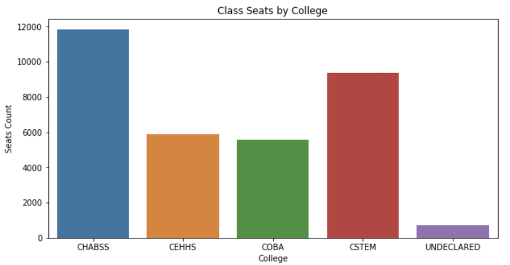

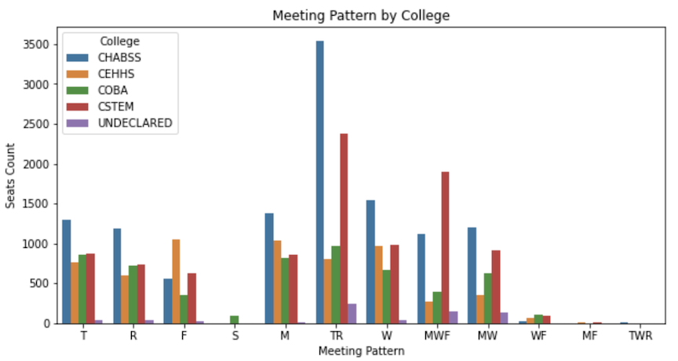

### Extracted Data - Student Profile

The university has more female students, but there are still more male students on Business and Stem Majors. Most of the students are under 25 years old. Due to the reduced number of Sophomore and Freshman students we can infer that the Covid pandemic restrictions for in person classes had a negative impact on enrollment for the past two years. 

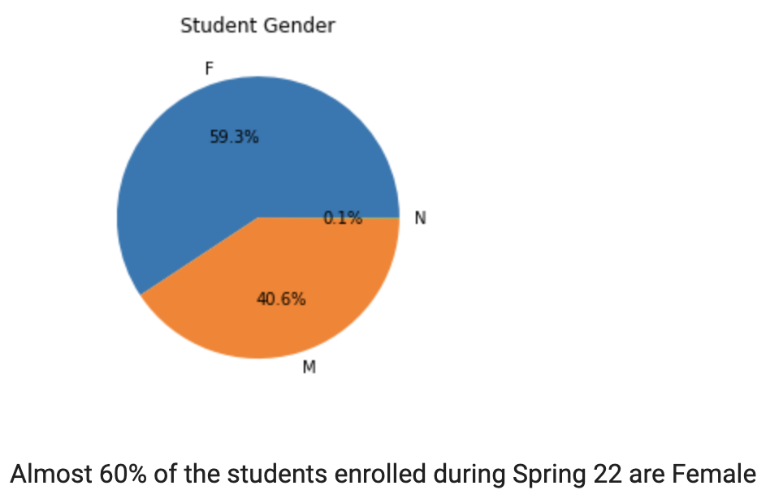

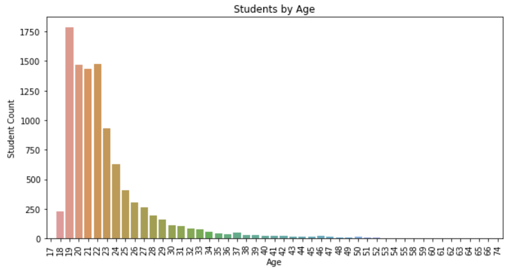

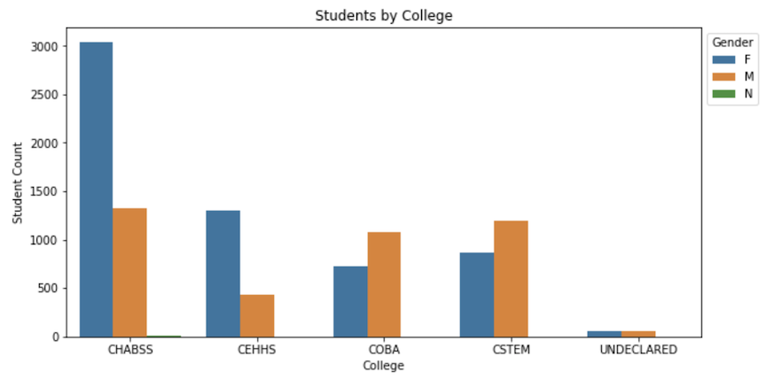

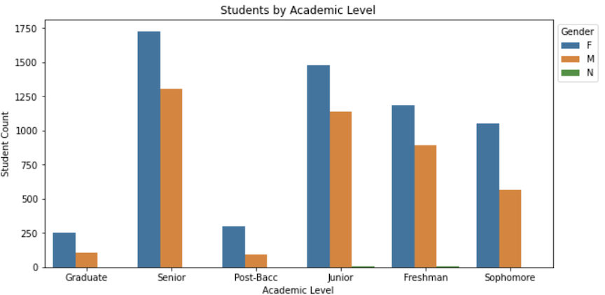

### Extracted Data - Where do they come from? 

Although students residency are scattered all over the country and the world, over 80% of the students reside within 50 miles from campus and can commute for in person classes. 

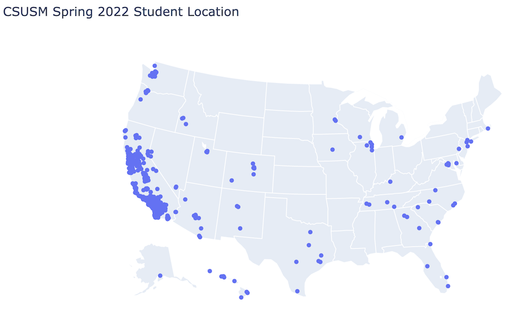

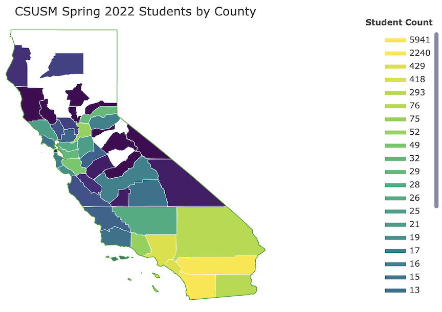

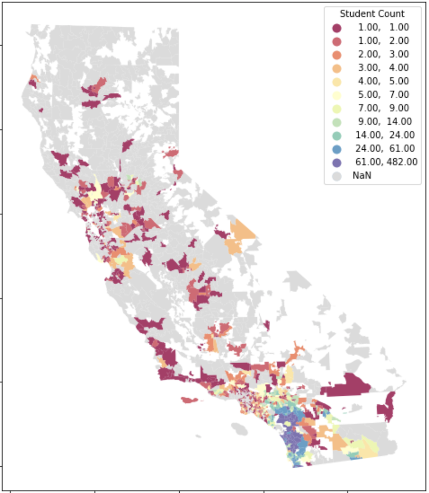

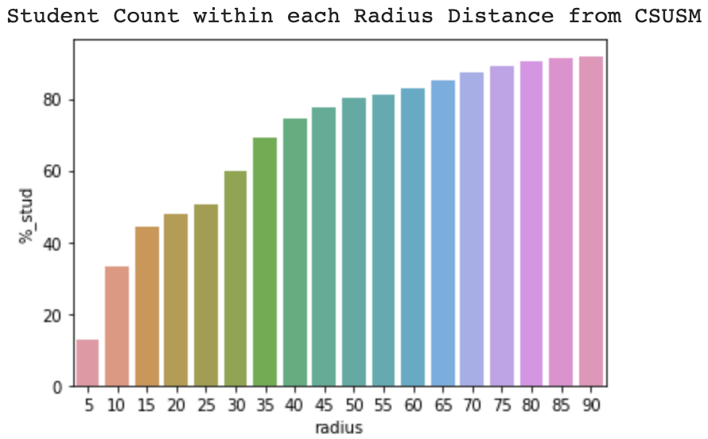

## Solution

### Requirements

What information we need to build the carpools?

Constraints: 
- Student location (zip code)
- Class schedule
- Role (driver, passenger, or either)
- Available seats in the vehicle for drivers

Preferences:
- Ride with students of the same gender
- Ride with students in the same age group
- Ride with students in the same college 
- Ride with non-smokers

### Computing the Compatibility Score 

To avoid making the preferences a constraint, a compatibility score is computed. 

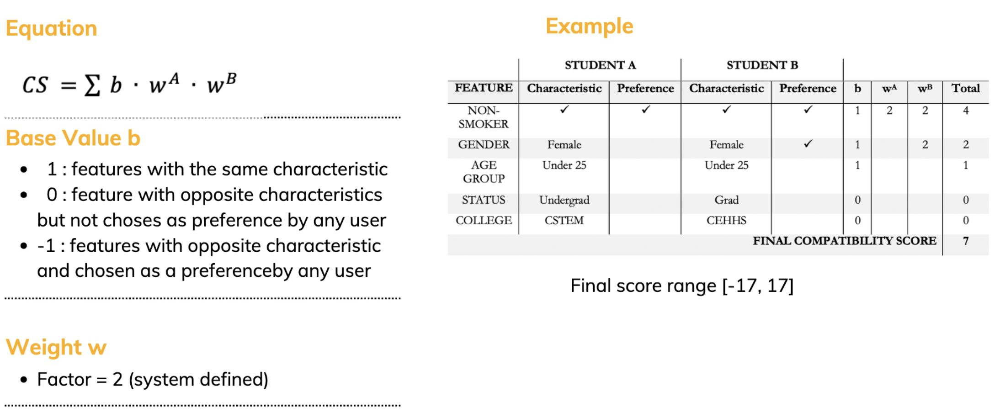

### Pre-processed Routes

Pre-processed routes are created using Open Street Map and saved into the database for fast look-up during the carpool creation. The images bellow show the road network within 70 miles distance from the main campus and some of the pre-processed routes ploted in red. 

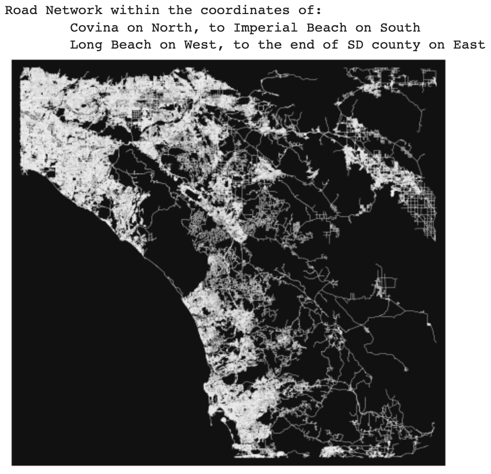

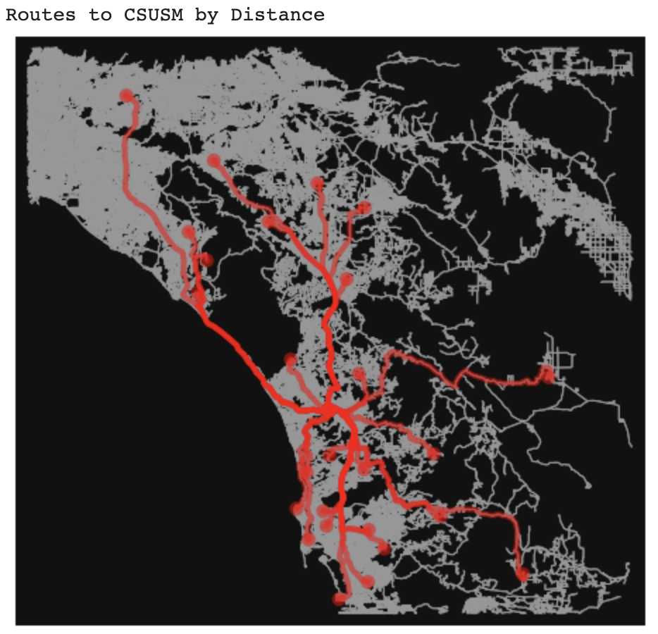

### Carpool Formation

1. Select a driver from the pool 
2. Create a carpool
3. Find candidates around this location
4. Compute the compatibility score
5. Select higher score candidates to fill up the seats
6. Check number of seats

   6a. If there are available seats, go to the next location and repeat the process from # 3
  
   6b. Else, save the carpool, and select another driver to restart the process 

### Results

The carpool automated tool using a search radius of 5 miles, search for matching any weekday schedule, and a relaxation of 30 minutes on the arrival/departure time constraint, can form carpool matches for 82% of the candidates on the target dataset with 1,500 students in one minute. 
 

## Google Colab notebooks:

- File Analysis: Extract students' data from Spring/22 class enrollemnt data, create base graph with routes from most common zip codes to campus

- Workflow: Create functions, validate results, test the carpool program flow

## Running the Program
All files to run the program are in the project folder. The file 'requirements.txt' has all dependencies

Note: The base graph file was too big to upload. To reproduce the project, create the base map using the google colab notebook and save it into project/media to run the program

